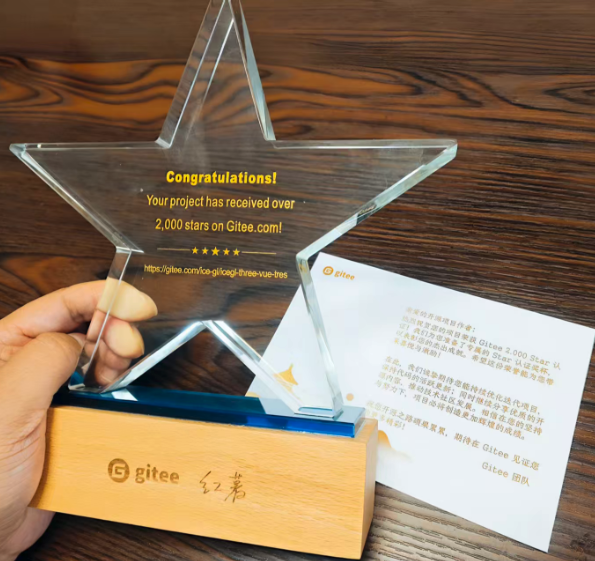
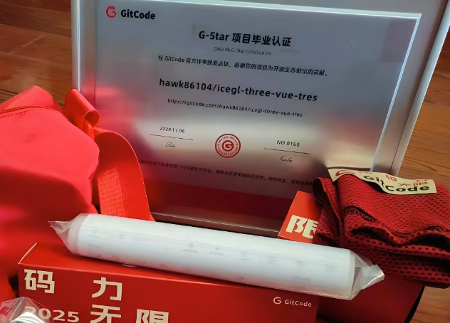
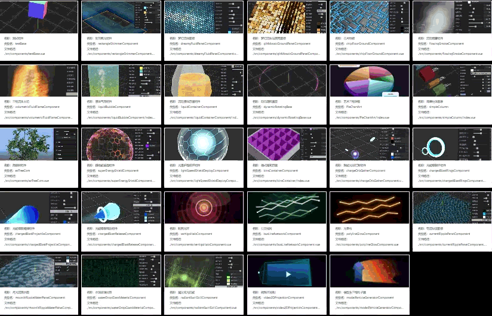
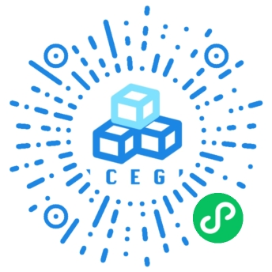
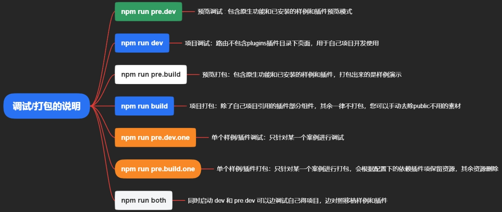
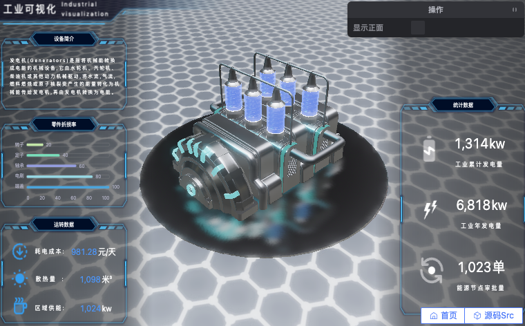
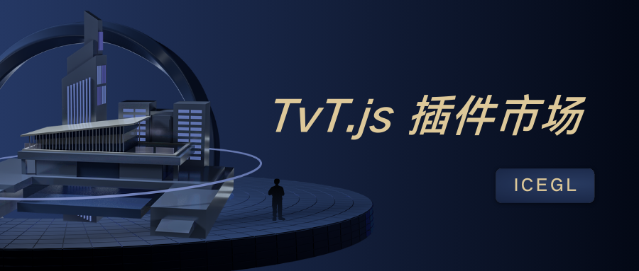
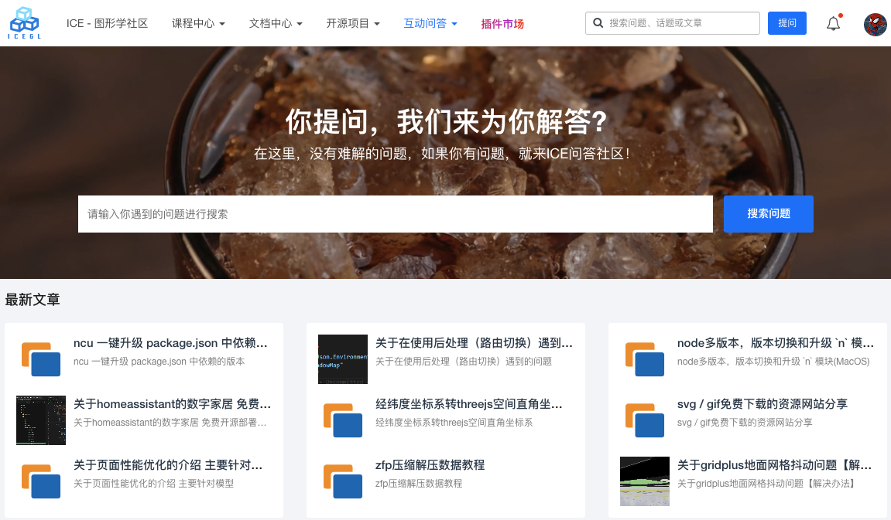
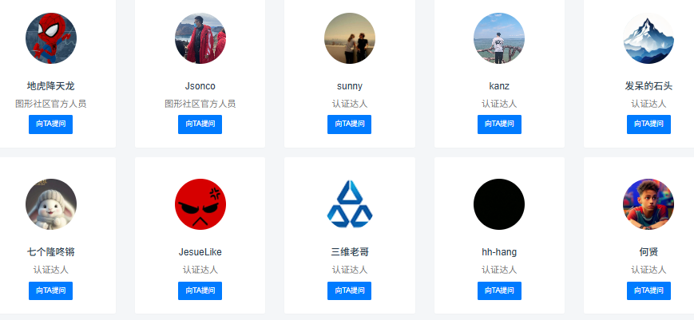
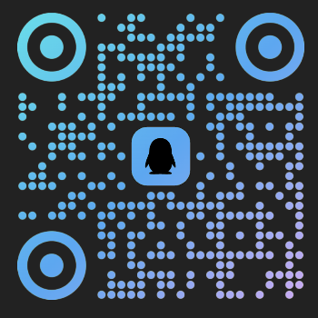

# 🧊🧊🧊 TvT.js 🧊🧊🧊
An open-source framework for building and shipping Web-based 3D visualization projects faster with Vue 3, Three.js, and TresJS.

English | [简体中文](./README_zh.md)

## 🎉🎉🎊 An Open-Source Framework for Rapid 3D Visualization Delivery 🎊🎉🎉

<p align="center">
  <a href="https://github.com/hawk86104/three-vue-tres" target="_blank">
    
  </a>
  
  
  <a target="_black" href="https://gitee.com/ice-gl/icegl-three-vue-tres">
    
  </a>
  <a target="_black" href="https://gitcode.com/hawk86104/icegl-three-vue-tres">
    
  </a>
  <a target="_black" href="https://space.bilibili.com/410503457">
    
  </a>
  <a target="_black" href="https://space.bilibili.com/384558900">
    
  </a>
</p>

```shell
If this project helps you, please click the "Star⭐" button in the upper-right corner. Your support is what keeps this project moving forward. Thank you!
```

> Since mid-October 2025, the project has fully upgraded its core dependencies, including Vue 3, Tres V5, Fes V4, Cientos V4, and Three.js (r17x → r18x).

> If you are upgrading from `tvt.js` V4, please refer to the migration guide: [icegl.cn/ask/article/22769](https://icegl.cn/ask/article/22769.html)

> Legacy V4 branch: [tres-v4_fes-v3](https://gitee.com/ice-gl/icegl-three-vue-tres/tree/tres-v4_fes-v3/)

<table style="border: none; width: 100%; text-align: center;">
  <tr>
    <td style="padding:10px;">
      
    </td>
    <td style="padding:10px;">
      
    </td>
  </tr>
</table>
<br/>

## 🇨🇳 Web 3D Visualization Framework for Domestic / Xinchuang Environments 🚩

For full localization and compatibility details, see the documentation: [Details](https://docs.icegl.cn/docs/three-vue-tres/guide/localization.html)

```shell
1️⃣ Support for domestic hardware platforms
2️⃣ Support for domestic operating systems and browsers
3️⃣ Domestic-friendly development and deployment environments
- You can confidently use tvt.js as the frontend foundation for localized 3D visualization projects and digital twin platforms.
- Built on a fully open-source dependency stack, with independent software intellectual property and software copyright registration, open-source and free for commercial use.
```

<a style="display:block;width:800px;max-width:100%;" href="https://www.bilibili.com/video/BV1JHqRB7ERB"></a>

# Ecosystem `@ThreeJS @Vue3.x @TresJS`

> Built by icegl. Permanently open-source, free for commercial use, and continuously updated. Please click the Star button in the upper-right corner to follow the project.

This project sits at the intersection of three major ecosystems:

- 🎲 ThreeJS · [Learn more](https://threejs.org)
  <a href="https://www.npmjs.com/package/three">
    
  </a>
  A widely used JavaScript 3D library for browser rendering.

- 🍀 Vue3.x · [Learn more](https://cn.vuejs.org)
  <a href="https://www.npmjs.com/package/vue">
    
  </a>
  A modern frontend framework that is approachable, high-performance, and flexible across many Web use cases.

- ⚡ TresJS · [Learn more](https://tresjs.org)
  <a href="https://www.npmjs.com/package/@tresjs/core">
    
  </a>
  A declarative Vue 3 way to build Three.js-powered 3D applications on the frontend.

## ✨ Dynamic Component Publishing & Loading Service: [🌏 dcser.icegl.cn](https://dcser.icegl.cn/)

> A dynamic component publishing and loading service built around the tvt.js ecosystem, designed for more flexible modular application delivery.

<a style="display:block;width:800px;max-width:100%;" href="https://dcser.icegl.cn"></a>

## 🏕 Preview: [🌏 opensource.icegl.cn](https://opensource.icegl.cn)

- If needed, you can also use the GitHub Pages mirror: [🌏 https://hawk86104.github.io](https://hawk86104.github.io/)
- Full-case WeChat Mini Program ecosystem: [🌏 Open in WeChat](#小程序://三维开源/456pgpJZBiTctdK)
- Scan the QR code to browse the full Mini Program demo set:
  

<table style="border: none; width: 100%; text-align: center;">
  <tr>
    <td style="padding:10px;font-size:1.2em;">
      <a href="https://zone3deditor.icegl.cn/#/plugins/zone3Deditor/index">
        Online 3D Scene Editor: [🪅 Free source export + secondary development]
      </a>
    </td>
    <td style="padding:10px;font-size:1.2em;">
      <a href="https://www.icegl.cn/tvtstore/zoneMachinRoom">
        Smart Server Room: [Project-ready output from the editor]
      </a>
    </td>
  </tr>
  <tr>
    <td style="padding: 10px;">
      <a href="https://zone3deditor.icegl.cn/#/plugins/zone3Deditor/index" style="display:block;max-width:100%;">
        
      </a>
    </td>
    <td style="padding: 10px;">
      <a href="https://www.icegl.cn/tvtstore/zoneMachinRoom" style="display:block;max-width:100%;">
        
      </a>
    </td>
  </tr>
  <tr>
    <td style="padding:10px;font-size:1.2em;">
      <a href="https://opensource.icegl.cn/#/plugins/zoneFreeScene/freeTvtStack">
        Tech Stack Topology: [Project-ready output from the editor]
      </a>
    </td>
    <td style="padding:10px;font-size:1.2em;">
      <a href="https://opensource.icegl.cn/#/plugins/zoneFreeScene/freeHYworld">
        Hunyuan World: [Project-ready output from the editor]
      </a>
    </td>
  </tr>
  <tr>
    <td style="padding: 10px;">
      <a href="https://zone3deditor.icegl.cn/#/plugins/zone3Deditor/index?sceneConfig=freeTvtStack" style="display:block;max-width:100%;">
        
      </a>
    </td>
    <td style="padding: 10px;">
      <a href="https://zone3deditor.icegl.cn/#/plugins/zone3Deditor/index?sceneConfig=freeHYworld" style="display:block;max-width:100%;">
        
      </a>
    </td>
  </tr>
  <tr>
    <td style="padding:10px;font-size:1.2em;">
      <a href="https://www.icegl.cn/tvtstore/zoneRefiningIndustry">
        Refining Smart Factory Visualization: [Project-ready output from the editor]
      </a>
    </td>
    <td style="padding:10px;font-size:1.2em;">
      <a href="https://www.icegl.cn/tvtstore/zoneOfficeFloor">
        Smart Office Space: [Project-ready output from the editor]
      </a>
    </td>
  </tr>
  <tr>
    <td style="padding: 10px;">
      <a href="https://oss.icegl.cn/p/zoneRefiningIndustry/#/plugins/zoneRefiningIndustry/index" style="display:block;max-width:100%;">
        
      </a>
    </td>
    <td style="padding: 10px;">
      <a href="https://oss.icegl.cn/p/zoneOfficeFloor/#/plugins/zoneOfficeFloor/index" style="display:block;max-width:100%;">
        
      </a>
    </td>
  </tr>
  <tr>
    <td style="padding:10px;font-size:1.2em;">
      <a href="https://www.icegl.cn/tvtstore/zoneLowAltitudeUAV.html">
        UAV Fleet Visualization: [Project-ready output from the editor]
      </a>
    </td>
    <td style="padding:10px;font-size:1.2em;">
      <a href="https://opensource.icegl.cn/#/#zoneFreeScene">
        Low-Poly Refinery: [Free]
      </a>
    </td>
  </tr>
  <tr>
    <td style="padding: 10px;">
      <a href="https://www.icegl.cn/tvtstore/zoneLowAltitudeUAV.html" style="display:block;max-width:100%;">
        
      </a>
    </td>
    <td style="padding: 10px;">
      <a href="https://zone3deditor.icegl.cn/#/plugins/zone3Deditor/index?sceneConfig=freeRefiningIndustry" style="display:block;max-width:100%;">
        
      </a>
    </td>
  </tr>
  <tr>
    <td style="padding:10px;font-size:1.2em;">
      <a href="https://www.icegl.cn/tvtstore/zonePixelLowMachinRoom">
        Low-Poly Server Room: [Project-ready output from the editor]
      </a>
    </td>
    <td style="padding:10px;font-size:1.2em;">
      <a href="https://www.icegl.cn/tvtstore/zonePlasticProducts">
        Plastic Products Factory 3D: [Project-ready output from the editor]
      </a>
    </td>
  </tr>
  <tr>
    <td style="padding: 10px;">
      <a href="https://oss.icegl.cn/p/zonePixelLowMachinRoom/#/plugins/zonePixelLowMachinRoom/index" style="display:block;max-width:100%;">
        
      </a>
    </td>
    <td style="padding: 10px;">
      <a href="https://oss.icegl.cn/p/zonePlasticProducts/#/plugins/zonePlasticProducts/secondaryCoding" style="display:block;max-width:100%;">
        
      </a>
    </td>
  </tr>
  <tr>
    <td style="padding:10px;font-size:1.2em;">
      <a href="https://www.icegl.cn/tvtstore/zoneSmartWarehouse">
        Smart Warehouse Management: [Project-ready output from the editor]
      </a>
    </td>
    <td style="padding:10px;font-size:1.2em;">
      <a href="https://opensource.icegl.cn/#/#zoneFreeScene">
        Ocean Shipping Visualization: [Free]
      </a>
    </td>
  </tr>
  <tr>
    <td style="padding: 10px;">
      <a href="https://oss.icegl.cn/p/zoneSmartWarehouse/#/plugins/zoneSmartWarehouse/secondaryCoding" style="display:block;max-width:100%;">
        
      </a>
    </td>
    <td style="padding: 10px;">
      <a href="https://zone3deditor.icegl.cn/#/plugins/zone3Deditor/index?sceneConfig=freeShipSea" style="display:block;max-width:100%;">
        
      </a>
    </td>
  </tr>
  <tr>
    <td style="padding:10px;font-size:1.2em;">
      <a href="https://www.icegl.cn/tvtstore/gisPlaneEditor">
        Map Space Editor: [A GIS editor for projected-map scenes]
      </a>
    </td>
    <td style="padding:10px;font-size:1.2em;">
      <a href="https://gisplaneeditor.icegl.cn/#/plugins/gisPlaneEditor/index?sceneConfig=多套倾斜摄影3D">
        Multi-Set Oblique Photography 3D: [Project-ready output from the editor]
      </a>
    </td>
  </tr>
  <tr>
    <td style="padding: 10px;">
      <a href="https://gisplaneeditor.icegl.cn/#/plugins/gisPlaneEditor/index" style="display:block;max-width:100%;">
        
      </a>
    </td>
    <td style="padding: 10px;">
      <a href="https://gisplaneeditor.icegl.cn/#/plugins/gisPlaneEditor/preview?sceneConfig=多套倾斜摄影3D" style="display:block;max-width:100%;">
        
      </a>
    </td>
  </tr>
</table>

> Tech stack topology example with full project source:
> [Source file](./src/plugins/zoneFreeScene/pages/freeTvtStack.vue)

> You can reopen this scene in the online editor and export the source again for secondary development:
> [Open in zone3Deditor](https://zone3deditor.icegl.cn/#/plugins/zone3Deditor/index?sceneConfig=freeTvtStack)

<a style="display:block;width:800px;max-width:100%;" href="https://opensource.icegl.cn/#/plugins/zoneFreeScene/freeTvtStack"></a>

```shell
Because the project is updated and rebuilt frequently, please clear your browser cache if you encounter access or asset-loading issues.
```

<a href="https://opensource.icegl.cn"></a>
<a href="https://opensource.icegl.cn"></a>

More demos are available on the preview site.

### If you like the project, please support it with a quick three-step combo: Follow 💛 Like ⭐ Fork 👣

# ✅ Quick Start

```js
1. git clone this repository, or download it directly

2. cd into the project root

3. yarn // install dependencies [Node.js >= 20.18]

4. yarn pre.dev // debug the preview workspace

5. yarn dev // debug your own project workspace

6. yarn pre.build // build the preview workspace

7. yarn build // build your own project workspace

8. yarn pre.dev.one // preview only one specific example or plugin

9. yarn pre.build.one // build one specific example or plugin; keep only configured dependency plugin assets and remove the rest

10. yarn both // run dev and pre.dev at the same time so you can develop your project while comparing against examples and plugins
```



# 📖 Documentation

## User Guide: [🌏 docs.icegl.cn](https://docs.icegl.cn/)

<table style="border: none; width: 100%; text-align: center;">
  <tr>
    <td style="padding:10px;font-size:1.2em;">
      <a href="https://docs.icegl.cn/docs/three-vue-tres/editor/threeeditor.html">
        3D Editor: [📊 Native editor + plugin generator]
      </a>
    </td>
    <td style="padding:10px;font-size:1.2em;">
      <a href="https://docs.icegl.cn/docs/three-vue-tres/editor/goview.html">
        UI Editor: [📊 GoView export + config import component]
      </a>
    </td>
  </tr>
  <tr>
    <td style="padding: 10px;">
      <a href="https://docs.icegl.cn/docs/three-vue-tres/editor/threeeditor.html" style="display:block;max-width:100%;">
        
      </a>
    </td>
    <td style="padding: 10px;">
      <a href="https://docs.icegl.cn/docs/three-vue-tres/editor/goview.html" style="display:block;max-width:100%;">
        
      </a>
    </td>
  </tr>
  <tr>
    <td style="padding:10px;font-size:1.2em;">
      <a href="https://docs.icegl.cn/docs/three-vue-tres/frontend/uniapp.html">
        uniapp Mini Program Ecosystem: [One codebase across platforms]
      </a>
    </td>
    <td style="padding:10px;font-size:1.2em;">
      <a href="https://docs.icegl.cn/docs/three-vue-tres/qiankun/introduction.html">
        qiankun Micro Frontend: [Integrate quickly into your existing project]
      </a>
    </td>
  </tr>
  <tr>
    <td style="padding: 10px;">
      <a href="https://docs.icegl.cn/docs/three-vue-tres/frontend/uniapp.html" style="display:block;max-width:100%;">
        
      </a>
    </td>
    <td style="padding: 10px;">
      <a href="https://docs.icegl.cn/docs/three-vue-tres/qiankun/introduction.html" style="display:block;max-width:100%;">
        
      </a>
    </td>
  </tr>
</table>

# 🧩 Rich Plugin Marketplace: [🌏 tvtstore](https://www.icegl.cn/tvtstore)

#### [🌏 www.icegl.cn/tvtstore](https://www.icegl.cn/tvtstore) includes a wide variety of project scenarios and features. Plugins are an important part of the ICE community ecosystem, and in the marketplace both complete applications and smaller modules are collectively referred to as plugins.

<table style="border: none; width: 100%; text-align: center;">
  <tr>
    <td style="padding:10px;font-size:1.2em;">
      <a href="https://www.icegl.cn/tvtstore">
        Plugin Marketplace
      </a>
    </td>
    <td style="padding:10px;font-size:1.2em;">
      <a href="https://www.icegl.cn/p/tvtdeveloper">
        Become an Author and Join Us
      </a>
    </td>
  </tr>
  <tr>
    <td style="padding: 10px;">
      <a href="https://www.icegl.cn/tvtstore" style="display:block;max-width:100%;">
        
      </a>
    </td>
    <td style="padding: 10px;">
      <a href="https://www.icegl.cn/p/tvtdeveloper" style="display:block;max-width:100%;">
        
      </a>
    </td>
  </tr>
</table>

# ❓ Feedback & Support

If you run into any issues while using the project, feel free to reach out through the channels below.

### Q&A Community: [ICE Graphics Community icegl.cn](https://www.icegl.cn/ask)

<a href="https://www.icegl.cn/ask" style="display:block;width:800px;max-width:100%;">
  
</a>

#### Community Contributors and Experts: [Ask the experts](https://icegl.cn/ask/experts.html)

<a href="https://icegl.cn/ask/experts.html" style="display:block;width:800px;max-width:100%;">
  
</a>

### You are also welcome to join our WeChat and QQ groups. Some groups may already be full, but we are always happy to connect and discuss WebGL together.

<table style="border: none; width: 60%; text-align: center;">
  <tr>
    <td style="padding:10px;font-size:1.2em;">
      WeChat Mini Program Ecosystem
    </td>
    <td style="padding:10px;font-size:1.2em;">
      WeChat Group
    </td>
    <td style="padding:10px;font-size:1.2em;">
      <a href="https://qm.qq.com/q/34V4hTtvbq">
        QQ Group: 795714357
      </a>
    </td>
    <td style="padding:10px;font-size:1.2em;">
      Official Account: ICE Graphics Community
    </td>
  </tr>
  <tr>
    <td style="padding: 10px;">
      <p style="display:block;max-width:100%;">
        
      </p>
    </td>
    <td style="padding: 10px;">
      <p style="display:block;max-width:100%;">
        
      </p>
    </td>
    <td style="padding: 10px;">
      <a href="https://qm.qq.com/q/34V4hTtvbq" style="display:block;max-width:100%;">
        
      </a>
    </td>
    <td style="padding: 10px;">
      <p style="display:block;max-width:100%;">
        
      </p>
    </td>
  </tr>
</table>

# ⭐ Star History

[](https://star-history.com/#hawk86104/three-vue-tres&hawk86104/vue3-ts-cesium-map-show&Date)

# ™️ Copyright Information

This project is open-sourced under the **Apache License 2.0**, is free to use permanently, and supports commercial use.

> If you use this project commercially, please comply with the Apache License 2.0 and retain the author attribution and technical support statement.

1. **Secondary Development and Copyright Notice**

   When building on top of this project, including but not limited to feature extensions, UI modifications, or custom adaptations, you must not remove, alter, or hide the copyright notice, author statement, or project source attribution in the header of TvT.js source files, whether your use is commercial or non-commercial.

2. **Allowed Commercial Use and Restrictions**

   You may use this project as the foundation for commercial solutions that are primarily based on your own independently developed core features or products, including paid services and software products.

   You may not simply re-open-source this project with only minor changes and charge for it, or package an almost unmodified version as a paid product for sale.

3. **Third-Party Components**

   Copyright and license information for third-party source code and binary files included in this project are marked separately. Please comply with their respective open-source licenses.

Copyright © 2022-2026 by 🧊icegl (https://www.icegl.cn)

All rights reserved.
